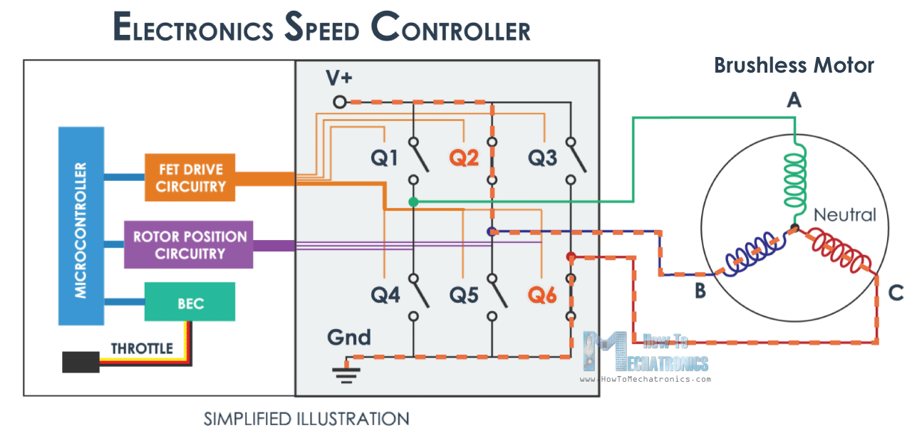

# Hades Mk1 ESC board

The Hades Mk1 ESC board is designed for 20-30A BLDC motor speed control. The board receives commands from the FCU (flight controller unit) through a PWM signal.
The board is powered by a 3C LiPo battery and is capable of 5VDC output. For rotor position sensing, the EMF method is used.

## Microcontroller unit

The brains behind the brawn is a Texas Instruments design, more specifically [TMS320F28027PTS](https://www.ti.com/product/TMS320F28027/part-details/TMS320F28027PTS), made specifically realtime signal processing.
The unit has 32-bit architecture.

## Motor driving logic

The board is capable of driving a 3P motor, hence it requires 6 transistors, setup as switches. By driving different transistor combinations
different phases of the motor can be powered. The transistors are driven by a MOSFET driver IC.

A simplified diagram of how this ESC board works.

Drawing credits to [HowToMechatronics](https://howtomechatronics.com/wp-content/uploads/2019/02/How-does-an-ESC-Work-Electronic-Speed-Controller.png).

## Authors

  - **Markus Erik Sügis** - 
    [sygism](https://github.com/sygism)

## License

This project is not licensed and is free to be used in any way.
